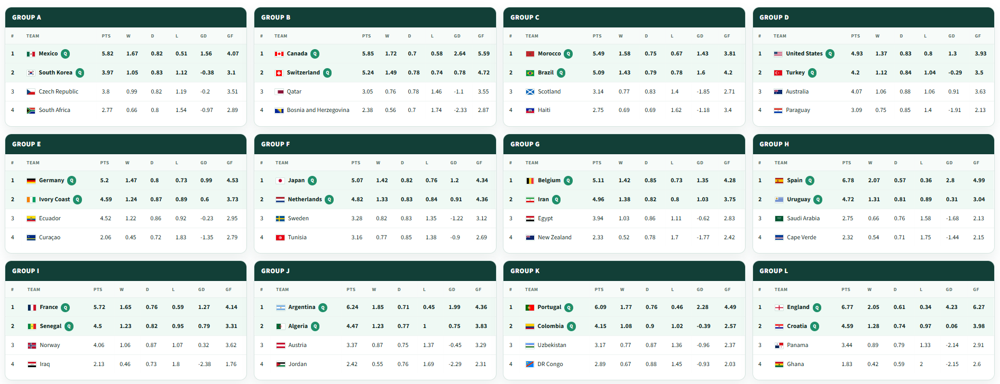
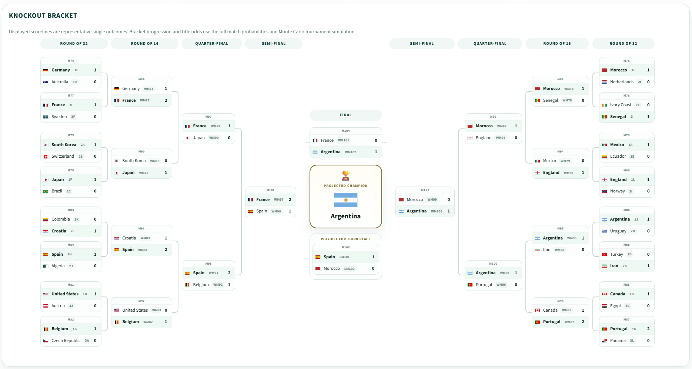

# World Cup Prediction

Local-first 2026 FIFA World Cup prediction pipeline with:

- real historical international results
- multi-source squad and context features
- a five-model ensemble
- full 48-team tournament simulation
- snapshot-based dashboard views
- adaptive result ingest for forward-only tournament updates

The repo is built around two ideas:

1. match-level predictions should combine multiple signals, not a single model
2. dashboard views should load from saved snapshots so later updates do not silently rewrite earlier tournament states

## What The Project Does

- Collects raw match, ranking, squad, injury, weather, travel, and macro data.
- Builds training and team-level features for the 2026 World Cup field.
- Trains a weighted ensemble for win/draw/loss probabilities.
- Uses Poisson-style goal distributions for representative scorelines and exact-score peaks.
- Simulates the 12-group, best-third-place, round-of-32 tournament format.
- Saves snapshot artifacts under `output/snapshots/` for dashboard playback and comparison.
- Supports adaptive result ingest so completed matches lock in and only future rounds change.

## Models Used

The current ensemble has five components in [`src/models/ensemble.py`](src/models/ensemble.py).

1. `Poisson` at 28%
   Estimates goal rates and supplies the match score distribution used for representative scorelines and most-likely exact scores.
2. `Boosted` at 21%
   Gradient-boosted outcome model on engineered match-difference features.
3. `Random Forest` at 17%
   Nonlinear outcome model that adds a different tree-based view of the same feature set.
4. `Elo` at 14%
   Rating-based outcome model anchored in historical strength.
5. `xG` at 20%
   Outcome model driven by xG-derived team features such as `xg_for_avg`, `xg_against_avg`, and over/under-performance.

Current weights live in [`src/utils/constants.py`](src/utils/constants.py).

After the base ensemble is combined, the project applies a contextual adjustment layer for:

- squad value and ratings
- player availability and injury load
- manager continuity and tactical balance
- rest days and travel fatigue
- weather
- macro-strength proxies

## Data Inputs

The implementation currently uses:

- real historical scores from the international results dataset
- internally generated ranking and Elo histories
- squad and player context from SOFIFA and Transfermarkt-derived files
- fixture weather context
- macro indicators from World Bank data
- official FIFA 2026 standings and Round-of-32 bracket snapshots under `data/external/`
- real xG coverage merged from:
  - StatsBomb Open Data
  - archived FiveThirtyEight international SPI xG matches

The xG merge and source audit are documented in [`docs/xg_source_audit.md`](docs/xg_source_audit.md).

The broader data flow is documented in [`docs/data_lineage.md`](docs/data_lineage.md).

## Tournament Simulation

The simulation layer does two different jobs:

- `Monte Carlo stage reach / title odds`
  Used for champion probabilities and notebook analysis such as "probability to reach each stage".
- `Deterministic bracket projection`
  Used for the dashboard bracket, where each knockout match advances the team with the stronger advancement signal.

Knockout scorelines are now aligned with the saved winner signal, so the displayed score supports the projected path instead of contradicting it.

Once all 72 group-stage matches are resolved in local state, the pipeline can also:

- merge official FIFA group-stage standings into team features as tournament-form calibration inputs
- swap the projected Round of 32 for the official FIFA bracket so later rounds advance from the real pairings

The guardrail is deliberate: these official tournament signals stay dormant before the group stage is complete, which avoids leaking future knowledge into pre-tournament or in-progress forecasts.

Stage-reach analysis lives in:

- [`notebooks/stage_reach_probabilities.ipynb`](notebooks/stage_reach_probabilities.ipynb)
- [`src/simulation/stage_reach.py`](src/simulation/stage_reach.py)

## Snapshots And Adaptive Flow

Snapshots are stored in `output/snapshots/<snapshot_id>/` and power the dashboard.

Each snapshot contains saved copies of:

- `predictions.json`
- `bracket_data.json`
- `standings.json`
- `team_features.json`
- `rosters.json`
- `state.json`
- `snapshot.json`

Practical behavior:

- dashboard views load from snapshot files, not live recomputation in the browser
- completed matches are locked into state
- future rounds are re-simulated forward from the locked state
- snapshots can still be refreshed if model artifacts change during experimentation

Core snapshot orchestration lives in:

- [`src/adaptive/engine.py`](src/adaptive/engine.py)
- [`src/adaptive/snapshotter.py`](src/adaptive/snapshotter.py)

## Dashboard

The Streamlit dashboard currently includes:

- overview with group tables and knockout bracket
- snapshot selector
- prediction table with match analysis modal
- snapshot accuracy summary
- compare tab for snapshot metadata

Example screenshots from the current implementation:

### Group Overview



### Knockout Bracket



## Repo Layout

```text
worldcup-prediction/
|- src/
|  |- adaptive/
|  |- api/
|  |- data/
|  |- features/
|  |- models/
|  |- scheduler/
|  |- simulation/
|  `- visualization/
|- data/
|  |- external/
|  |- processed/
|  `- raw/
|- docs/
|- notebooks/
|- output/
`- tests/
```

## How To Run

### 1. Set up the environment

Windows:

```powershell
python -m venv .venv
.\.venv\Scripts\Activate.ps1
pip install -r requirements.txt
```

### 2. Collect raw data

```powershell
.\.venv\Scripts\python.exe -m src.data.collector --all --refresh
```

### 3. Build features

```powershell
.\.venv\Scripts\python.exe -m src.features.build_features
```

Optional, when the live tournament is underway:

```powershell
.\.venv\Scripts\python.exe -m src.data.fifa_official --refresh
```

### 4. Train the ensemble

```powershell
.\.venv\Scripts\python.exe -m src.models.train --all
```

### 5. Run a simulation

```powershell
.\.venv\Scripts\python.exe -m src.simulation.tournament --iterations 500
```

### 6. Launch the dashboard

Use the repo environment explicitly:

```powershell
.\.venv\Scripts\python.exe -m streamlit run src/visualization/dashboard.py
```

The dashboard will auto-create `000_baseline` if no snapshot exists yet.

### 7. Launch the API

```powershell
.\.venv\Scripts\python.exe -m uvicorn src.api.main:app --reload --host 0.0.0.0 --port 8000
```

## Makefile Shortcuts

If `make` is available in your shell:

```bash
make collect-data
make engineer-features
make train-models
make simulate ITERATIONS=500
make serve-dashboard
make serve-api
make snapshot-real-groups
make test
```

## Adaptive Commands

Ingest one completed result:

```powershell
make ingest-result match_id=GRP-A-M1 score=2-1
```

Compare snapshots:

```powershell
make compare-snapshots from=000_baseline to=001_after_grp-a-m1
```

Rollback to an earlier state branch:

```powershell
make rollback-to snapshot=000_baseline
```

Ingest the full real group stage and refresh official FIFA calibration inputs:

```powershell
.\.venv\Scripts\python.exe scripts/ingest_group_stage.py
```

Or, if `data/external/real_group_stage_results.csv` is present, use the dashboard button to build the comparison snapshot while keeping `000_baseline` available in the selector.

## API Endpoints

Current FastAPI routes in [`src/api/routes.py`](src/api/routes.py):

- `GET /`
- `POST /predict/match`
- `GET /predict/bracket`
- `POST /simulate/run`
- `GET /simulate/results`
- `GET /teams`
- `GET /feature-importance`
- `POST /ingest/result`
- `GET /state/matches`
- `GET /snapshots`

## Tests

Run the test suite with:

```powershell
.\.venv\Scripts\python.exe -m pytest tests -q
```

Coverage currently focuses on:

- data collection and loaders
- feature artifact creation
- ensemble output behavior
- knockout and stage-reach simulation
- adaptive snapshot flow
- API smoke checks

## Related Docs

- [`PRD.md`](PRD.md)
- [`docs/data_lineage.md`](docs/data_lineage.md)
- [`docs/example_argentina_vs_uruguay_r32.md`](docs/example_argentina_vs_uruguay_r32.md)
- [`docs/xg_source_audit.md`](docs/xg_source_audit.md)

## Current Limitations

- the dashboard is still local-first, not production deployed
- live source freshness varies by source type and refresh schedule
- snapshot storage is file-backed rather than database-backed
- stage-reach and bracket outputs are complementary views, not the same object
- exact scorelines remain illustrative; probabilities are the stronger signal
