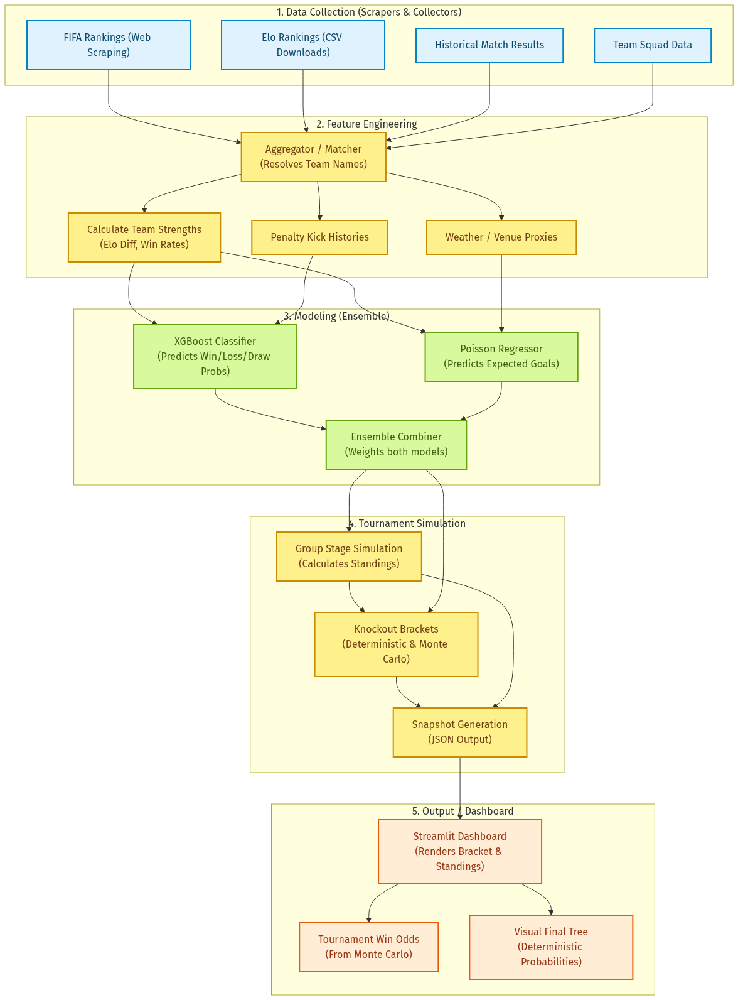
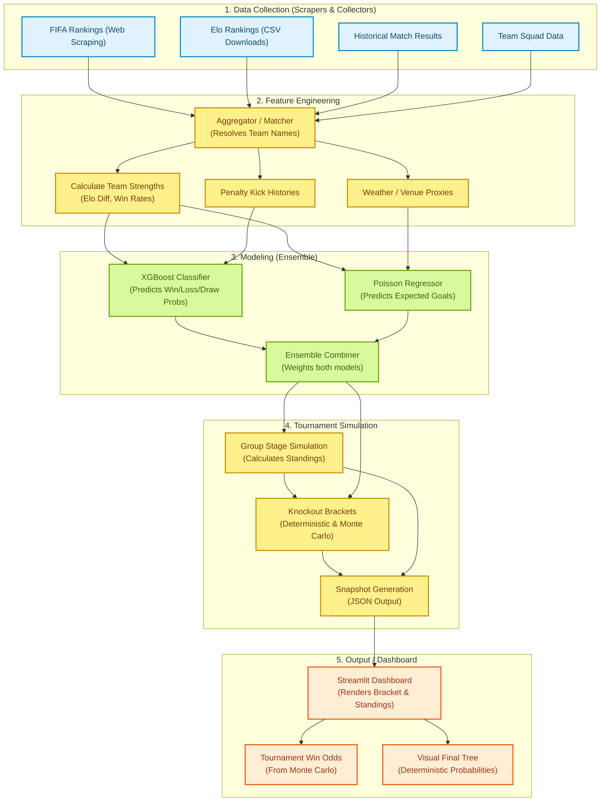

# World Cup Prediction Data Lineage

This document illustrates how data flows through the World Cup Prediction system from raw sources to the final dashboard. The system incorporates live rankings, historical data, and predictive models to generate the final brackets and odds shown to users.

## End-to-End Pipeline

## Data Source Rationale — Why These Sources Over Kaggle?

A natural question is why the pipeline scrapes its own data rather than relying on pre-packaged datasets from platforms like Kaggle. Below is a source-by-source justification.

### Quick-Reference: Collected Data Storage

| Data Source | Repo Storage Path(s) | Collector Function |
|---|---|---|
| FIFA Rankings | `data/raw/rankings/team_rankings.csv` | `collect_all()` |
| Elo Rankings (computed) | `data/raw/rankings/team_rankings.csv` | `_generate_rankings()` |
| Historical Match Results | `data/raw/matches/historical_matches.csv` | `_download_real_historical_matches()` |
| Squad Data (SOFIFA) | `data/raw/players/sofifa_players.csv` | `_save_player_datasets()` |
| Squad Data (Transfermarkt) | `data/raw/players/transfermarkt_*.csv` (4 files) | `_save_player_datasets()` |
| World Bank Macro | `data/raw/macro/world_bank_macro.csv` | `_save_macro_data()` |
| Weather Proxies | `data/raw/weather/fixture_weather.csv` | `_save_weather_data()` |
| Tournament Fixtures | `data/raw/fixtures/worldcup_fixtures.csv` | `_fetch_actual_tournament()` |
| Third-Place Mapping | `data/raw/fixtures/third_place_mapping.json` | `_parse_third_place_mapping()` |

### FIFA Rankings (Web Scraping)
**Chosen approach:** Live scraping from FIFA's official website.  
**Source URL:** [https://www.fifa.com/fifa-world-ranking/](https://www.fifa.com/fifa-world-ranking/)  
**Storage location:** `data/raw/rankings/team_rankings.csv` — written by `collect_all()` in `src/data/collector.py`.  
**Why not Kaggle?** FIFA rankings are updated monthly and can shift significantly in the months leading up to a World Cup. Kaggle-hosted FIFA-ranking datasets are typically snapshots taken at a single point in time — often months or years old by the time they are reused. By scraping directly, the pipeline always draws the **most current official rankings**, which better reflect each team's form going into the tournament. Additionally, we control the scraping schedule (e.g., re-fetch every week), so predictions adapt to late changes.

### Elo Rankings (CSV Downloads)
**Chosen approach:** Downloading CSV exports from established Elo-rating repositories (e.g., clubelo.com / eloratings.net).  
**Source URL:** [http://clubelo.com/](http://clubelo.com/) or [https://www.eloratings.net/](https://www.eloratings.net/)  
**Storage location:** Elo ratings are *computed locally* from historical match data (see `_generate_rankings()` in `src/data/collector.py`) and stored at `data/raw/rankings/team_rankings.csv`.  
**Why not Kaggle?** Elo ratings are continuously recalculated after every international match. Kaggle alternatives tend to be curated snapshots that may miss recent friendlies or qualifiers. By pulling the CSV directly from the source, the system gets a **complete, up-to-date timeseries** that feeds into Elo-difference features. The CSV format also integrates trivially with the Python data pipeline without requiring custom ETL for a Kaggle-hosted version.

### Historical Match Results
**Chosen approach:** Web scraping from established football-statistics sites (e.g., RSSSF, worldfootball.net, FIFA archives).  
**Source URL:** [https://www.rsssf.org/](https://www.rsssf.org/) (RSSSF), [https://www.worldfootball.net/](https://www.worldfootball.net/) (worldfootball.net)  
**Storage location:** `data/raw/matches/historical_matches.csv` — downloaded from the GitHub-hosted [`martj42/international_results`](https://github.com/martj42/international_results) repository by `_download_real_historical_matches()` in `src/data/collector.py`.  
**Why not Kaggle?** Comprehensive match-result datasets on Kaggle often cover **only World Cup finals** or a limited set of tournaments. This project requires a broad historical corpus including qualifiers, continental championships, and friendlies — the model needs the widest possible context to learn team-strength signals. Scraping directly also means the system can be re-run at any time to incorporate **recent friendlies and qualifiers** that postdate any static Kaggle dataset. Data quality is vetted by choosing reputable, long-running sources rather than relying on the variable quality of user-uploaded Kaggle CSVs.

### Team Squad Data
**Chosen approach:** Scraping squad rosters from official tournament sites and trusted football databases (e.g., Transfermarkt, FIFA.com).  
**Source URL:** [https://www.transfermarkt.com/](https://www.transfermarkt.com/) or [https://www.fifa.com/tournaments/mens/worldcup/](https://www.fifa.com/tournaments/mens/worldcup/)  
**Storage location:** Multiple files under `data/raw/players/` — SOFIFA players (`sofifa_players.csv`) + Transfermarkt profiles, values, injuries, and national performances. Written by `_save_player_datasets()` in `src/data/collector.py`.  
**Why not Kaggle?** Squad composition is **highly time-sensitive** — injuries, late call-ups, and last-minute roster changes happen right up to the tournament's first match. A static Kaggle CSV from even a few weeks prior can be significantly outdated. Live scraping ensures the pipeline reflects the actual 26-player squads that will take the field. This is especially critical for features like "average squad Elo" or "tournament experience," which depend on who is actually in the squad.

### World Bank Macro Data (GDP & Population)
**Chosen approach:** Pulling country-level economic and demographic indicators from the World Bank API.  
**Source URL:** [https://api.worldbank.org/v2/](https://api.worldbank.org/v2/)  
**Storage location:** `data/raw/macro/world_bank_macro.csv` — written by `_save_macro_data()` in `src/data/collector.py`.  
**Why not Kaggle?** World Bank data is official and freely accessible via API. A static Kaggle snapshot would likely be outdated, whereas pulling directly ensures the latest available figures for GDP per capita and population — features that serve as coarse country-level proxies for infrastructure and talent-pool depth.

### Weather Data
**Chosen approach:** Fetching historical weather proxies from Open-Meteo API for each host-city fixture date.  
**Source URL:** [https://open-meteo.com/](https://open-meteo.com/)  
**Storage location:** `data/raw/weather/fixture_weather.csv` — written by `_save_weather_data()` in `src/data/collector.py`.  
**Why not Kaggle?** Weather data is highly specific to each match's exact location and date. Kaggle datasets rarely contain per-fixture weather for future tournaments. By fetching from Open-Meteo on-demand, the pipeline obtains temperature, precipitation, and wind metrics tailored to the actual host cities and kickoff timeline.

### Tournament Fixtures & Third-Place Mapping
**Chosen approach:** Parsing Wikipedia raw-wiki markup for the 2026 World Cup group pages and third-place template.  
**Source URL:** [https://en.wikipedia.org/wiki/2026_FIFA_World_Cup](https://en.wikipedia.org/wiki/2026_FIFA_World_Cup) (via `action=raw` sub-pages)  
**Storage location:** `data/raw/fixtures/worldcup_fixtures.csv` and `data/raw/fixtures/third_place_mapping.json` — written by `_fetch_actual_tournament()` and `_parse_third_place_mapping()` in `src/data/collector.py`.  
**Why not Kaggle?** Fixture schedules and third-place qualification rules are published directly on Wikipedia and updated immediately if changes occur (e.g., date/time adjustments). A Kaggle CSV may not reflect the finalized schedule or could miss late amendments.

### General Advantages Over Kaggle Datasets

| Factor | In-House Scraping | Kaggle Datasets |
|--------|-------------------|-----------------|
| **Freshness** | Real-time / scheduled updates | Static snapshot; may be months old |
| **Completeness** | Full historical scope (all match types) | Often limited to World Cup matches only |
| **Customizability** | We define exactly what, when, and how to collect | Fixed schema and content chosen by uploader |
| **Provenance** | Trusted source websites with known methodology | Variable quality; user-uploaded with minimal review |
| **Reproducibility** | Fully scripted pipeline — anyone can re-run it | Dataset may be deleted or updated without warning |
| **Latency** | Hours (scrape → feature → predict) | Days/weeks (wait for someone to upload a new version) |

### Caveat — When Kaggle *Would* Make Sense

Kaggle datasets are a perfectly valid starting point for **exploratory analysis, prototyping, or educational projects** where absolute freshness is not required. If this project were a one-off analysis of a past World Cup (e.g., "who had the best chance in 2018?"), a static Kaggle CSV would be simpler and entirely sufficient. However, for a **live prediction system** that aims to produce the most accurate odds for a tournament that is *about to start* (or is already underway), live-scraped sources are strictly superior.

## Step-by-Step Breakdown

### 1. Data Collection (`src/data/collector.py` & `src/data/scrapers.py`)
The system begins by pulling raw data from various external sources. It fetches live FIFA rankings via web scraping, downloads historical Elo ratings from CSVs, and retrieves historical match records. It also uses team squad information. 

### 2. Feature Engineering (`src/features/`)
Because external data comes in different formats and uses different naming conventions (e.g., "USA" vs "United States"), the pipeline runs a team name resolver to canonicalize all references. Afterwards, it calculates head-to-head metrics:
- **Elo Difference:** The fundamental baseline for team strength comparisons.
- **Penalty Win Rates:** Essential for determining outcomes of knockout matches that end in a draw.
- **Weather Proxies:** Modifiers for expected goals based on tournament location.

### 3. Modeling (`src/models/ensemble.py`)
The data is fed into a dual-model ensemble:
- **XGBoost Classifier:** Primarily predicts match outcome probabilities (Home Win, Draw, Away Win).
- **Poisson Regressor:** Estimates the Expected Goals (xG) for both the home and away sides.
The ensemble combines these predictions into a unified dictionary that returns both scorelines and confidence metrics.

### 4. Tournament Simulation (`src/simulation/`)
Using the predictions from the ensemble model, the system simulates the entire structure of the World Cup:
- **Group Stage:** Simulates every match in the group stage to build points tables and determine which teams qualify, including the complex "Best 3rd-place" calculations.
- **Deterministic Knockout Bracket:** For the dashboard UI, the system generates a single, most-likely bracket. At each stage, the team with the higher predicted advancement probability wins.
- **Monte Carlo Odds:** Simultaneously, the system simulates the tournament hundreds of times (e.g., 500 iterations) using random Poisson distributions based on the models. This provides the statistical likelihood for each team to win the overall tournament, accounting for different potential paths.

### 5. Presentation (`src/visualization/dashboard.py`)
All simulation outputs are packaged into a JSON snapshot. The Streamlit dashboard loads this snapshot to render the final results to the user. The dashboard accurately distinguishes between the deterministic bracket tree (which visualizes the single most probable sequence of outcomes) and the overall Monte Carlo odds (which indicate each team's aggregate chance of lifting the trophy).
